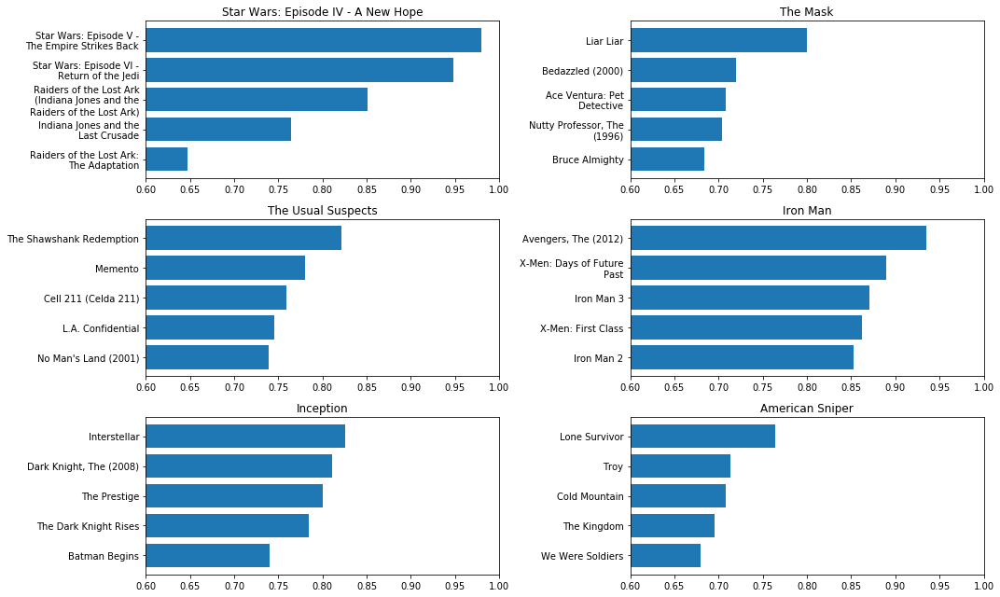
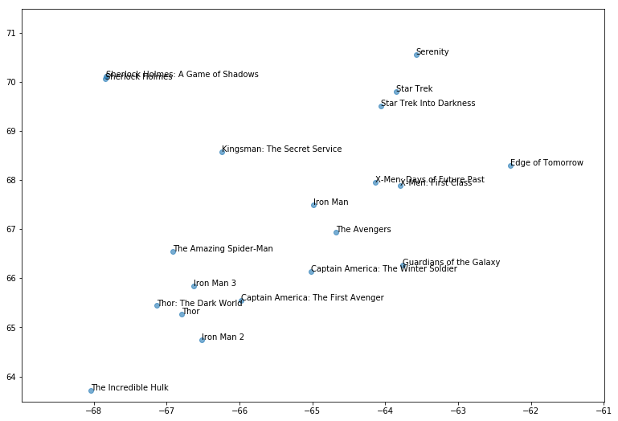

# Model 3 : Deep Learning to learn User and Movie Embeddings

### Model Description
- 

### Description of the Algorithm 
- 

## Parameters of the Model
-

[Code](training_embeddings.ipynb)

## Design Choices to consider


## Parameter Tuning and Optimal Model 

{:height="24px" width="48px"}


## Model Results and Explainability






[Code](visualising_embeddings.ipynb)

## Requirements
```
Tensorflow: 1.1.0
Keras: 2.1.6
Python version : 3.6
RAM : 16GB
```
