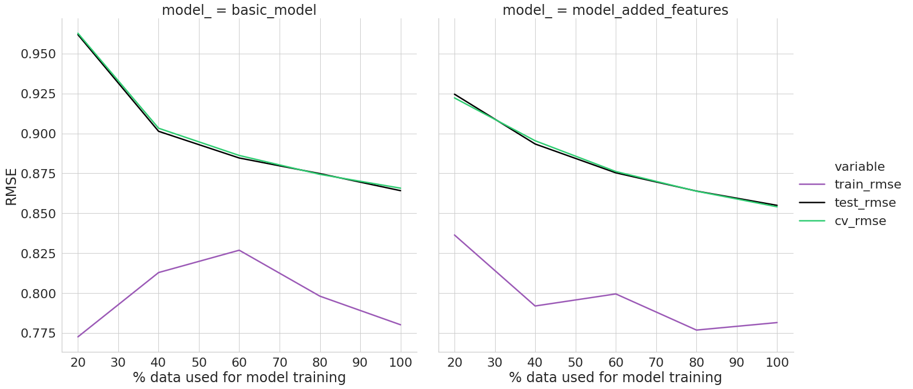
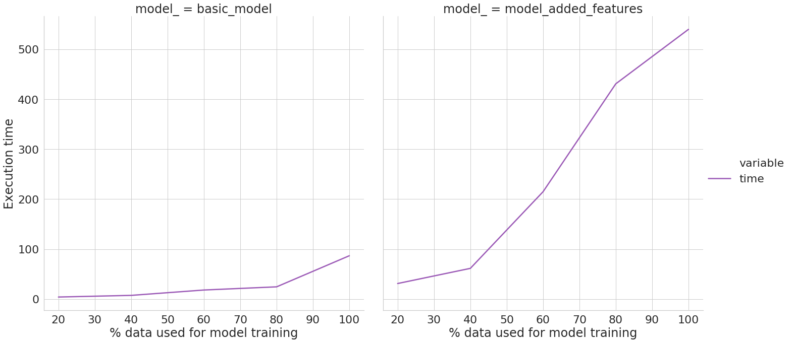
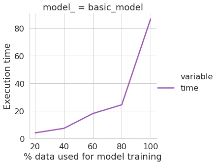
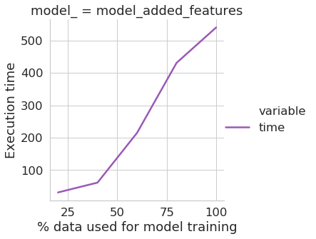
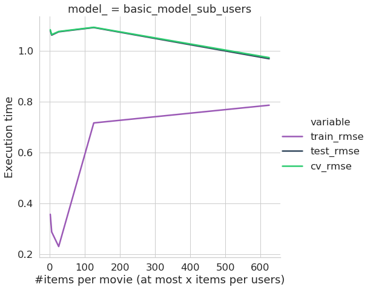
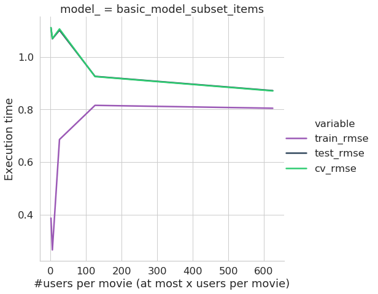
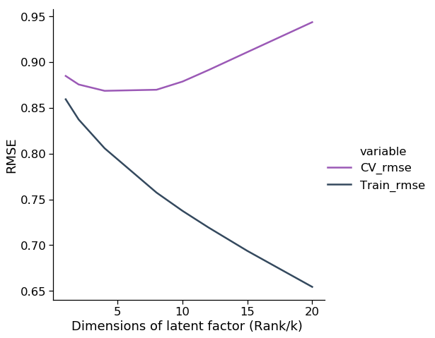

### Background : A matrix factorization based model on Movielens-1M

What we accomplished in the previous project in HW2?

Matrix Factorization - drawbacks

### What are Factorization machines?

### Methodolgy

#### How initial FM package we tried failed? 

[xlearn](https://github.com/aksnzhy/xlearn) was initially used to test out FM on the movielens dataset as the package authors claim that it is as fast libffm and libfm. The package requires data to be input in __libsvm__ and __libffm__ formats.

__libsvm__ format :
<label> <feature1>:<value1> <feature2>:<value2>

__libffm__ format :
<label> <field1>:<feature1>:<value1> <field2>:<feature2>:<value2>
    
This requires dataset specific transformations which require extensive quality checks. However, even after several iterations and paramter tuning we could only achieve the best RMSE of 0.98

### Comparison of the different models built


### Paramters used in the model
* rank : The rank of the factorization used for the second order interactions
* epochs : The number or iterations over the training set for ALS.
* l2_reg : L2 penalty weight for all coefficients (default=0).


### Future Tasks
* Engineer addition features like last movie rated, number of days since first  rated movie, movie tags, addition info imdb, wikipedia
* test separate regularization parameters for second order and first order terms
* increase the range of hyperspace used for parameter training
* A/B test the three approaches discussed


### Requirements 
```
Python version : 3.7
OS :  Linux (Ubuntu 14.04 LTS) and OS X Mavericks (ONLY! for both xlearn and fastfm)
RAM : 8GB
Free Space : 20GB
```


### FastFM walkthrough

```python
import numpy as np
import pandas as pd
from sklearn.metrics import roc_auc_score, mean_squared_error;
from sklearn.model_selection import train_test_split,ShuffleSplit,GridSearchCV;
from fastFM.mcmc import FMClassification, FMRegression;
from sklearn.preprocessing import OneHotEncoder;
from fastFM import als;
from sklearn.feature_extraction.text import CountVectorizer;
import gc;
import pickle;
import random;
import matplotlib.pyplot as plt;
import time;
import seaborn as sns;
```

Doumentation : http://ibayer.github.io/fastFM/

### Model A: Basic model with just userId and movieId


```python
def encode(df):
    
    '''
    Input : train and test sets
    Output : One hot encoded datasets
    '''
    
    encoder = OneHotEncoder(handle_unknown='ignore').fit(df)
    #trainX = encoder.transform(trainX)
    #testX = encoder.transform(testX)
    
    return encoder
```


```python
ratings = np.genfromtxt('./ml-1m/ratings.dat',delimiter="::")
ratings =  pd.DataFrame(ratings)

ratings.columns = ['userId','movieId','rating','timestamp']
ratings = ratings.drop('timestamp', axis=1)
y = ratings['rating'].values
X = ratings.drop('rating', axis=1)

#trainX, testX, trainY, testY = train_test_split(X, y, test_size=0.20, random_state=1234)
#trainX, testX = encode(trainX,testX)

encoder = encode(X)

##fixed
#trainX, testX, trainY, testY = train_test_split(X, y, test_size=0.10, random_state=1234)
trainX = encoder.transform(trainX)
testX = encoder.transform(testX)

cv = ShuffleSplit(n_splits=3, test_size= int(0.2 * trainX.shape[0]), random_state = 2018)


estimator = als.FMRegression()

params = {
'n_iter' : np.arange(10,100,30),
'rank' :  np.arange(2,12,4),
'l2_reg_w': np.logspace(-6, -1, 3),
'l2_reg_V' : np.logspace(-6, -1, 3)
}

###Gridsearch over parameters
regressor = GridSearchCV(estimator=estimator , cv=cv, param_grid=params)
regressor.fit(trainX, trainY)

###get RMSE
mean_squared_error(regressor.predict(testX),testY)**0.5
```


    0.8771354587448218


### Model B : Adding user data, genre, year of movie


```python
users = pd.read_csv('./ml-1m/users.dat', sep='::', names=['userId', 'gender', 'age', 'occupation', 'zip'], \
                    header=None)
users.head()
```

    /home/som/anaconda3/lib/python3.6/site-packages/ipykernel_launcher.py:1: ParserWarning: Falling back to the 'python' engine because the 'c' engine does not support regex separators (separators > 1 char and different from '\s+' are interpreted as regex); you can avoid this warning by specifying engine='python'.
      """Entry point for launching an IPython kernel.


<div>
<style scoped>
    .dataframe tbody tr th:only-of-type {
        vertical-align: middle;
    }

    .dataframe tbody tr th {
        vertical-align: top;
    }

    .dataframe thead th {
        text-align: right;
    }
</style>
<table border="1" class="dataframe">
  <thead>
    <tr style="text-align: right;">
      <th></th>
      <th>userId</th>
      <th>gender</th>
      <th>age</th>
      <th>occupation</th>
      <th>zip</th>
    </tr>
  </thead>
  <tbody>
    <tr>
      <th>0</th>
      <td>1</td>
      <td>F</td>
      <td>1</td>
      <td>10</td>
      <td>48067</td>
    </tr>
    <tr>
      <th>1</th>
      <td>2</td>
      <td>M</td>
      <td>56</td>
      <td>16</td>
      <td>70072</td>
    </tr>
    <tr>
      <th>2</th>
      <td>3</td>
      <td>M</td>
      <td>25</td>
      <td>15</td>
      <td>55117</td>
    </tr>
    <tr>
      <th>3</th>
      <td>4</td>
      <td>M</td>
      <td>45</td>
      <td>7</td>
      <td>02460</td>
    </tr>
    <tr>
      <th>4</th>
      <td>5</td>
      <td>M</td>
      <td>25</td>
      <td>20</td>
      <td>55455</td>
    </tr>
  </tbody>
</table>
</div>


```python
gc.collect()
```


    2082


```python
movies = pd.read_csv('./ml-1m/movies.dat', sep='::', names=['movieId', 'title', 'genres'], header=None)
movies.head()
movies['year'] = movies.title.apply(lambda x : x[-5:-1])

sparse_genres = pd.DataFrame(CountVectorizer().fit_transform(movies.genres\
                                .map(lambda x: x.replace('|', ' '))).todense())

movies = pd.concat([movies[['movieId']], sparse_genres], axis=1) 


ratings = np.genfromtxt('./ml-1m/ratings.dat',delimiter="::")
ratings =  pd.DataFrame(ratings)

ratings.columns = ['userId','movieId','rating','timestamp']
ratings = ratings.drop('timestamp', axis=1)

ratings = pd.merge(pd.merge(ratings, users, on='userId'), movies, on='movieId')


y = ratings['rating'].values
X = ratings.drop('rating', axis=1)

for feature in X.columns:
    _,X[feature] = np.unique(X[feature], return_inverse=True)

trainX, testX, trainY, testY = train_test_split(X, y, test_size=0.20, random_state=1234)
encoder = encode(X)

##fixed
#trainX, testX, trainY, testY = train_test_split(X, y, test_size=0.10, random_state=1234)
trainX = encoder.transform(trainX)
testX = encoder.transform(testX)


cv = ShuffleSplit(n_splits=3, test_size= int(0.2 * trainX.shape[0]), random_state = 2018)
estimator2 = als.FMRegression()

params = {
'n_iter' : np.arange(10,100,30),
'rank' :  np.arange(2,12,4),
'l2_reg_w': np.logspace(-6, -1, 3),
'l2_reg_V' : np.logspace(-6, -1, 3)
}

###Gridsearch over parameters
regressor2 = GridSearchCV(estimator=estimator2 , cv=cv, param_grid=params)
regressor2.fit(trainX, trainY)

###get RMSE
mean_squared_error(regressor2.predict(testX),testY)**0.5
```


    0.8783405327095336


```python
pickle.dump(regressor,open("./dump_regressor1","wb"))
pickle.dump(regressor2,open("./dump_regressor2","wb"))
```


```python
regressor1 = pickle.load(open("./dump_regressor","rb"))
```


    GridSearchCV(cv=ShuffleSplit(n_splits=3, random_state=2018, test_size=160033, train_size=None),
           error_score='raise',
           estimator=FMRegression(init_stdev=0.1, l2_reg=0, l2_reg_V=0.1, l2_reg_w=0.1, n_iter=100,
           random_state=123, rank=8),
           fit_params=None, iid=True, n_jobs=1,
           param_grid={'n_iter': array([10, 40, 70]), 'rank': array([ 2,  6, 10]), 'l2_reg_w': array([1.00000e-06, 3.16228e-04, 1.00000e-01]), 'l2_reg_V': array([1.00000e-06, 3.16228e-04, 1.00000e-01])},
           pre_dispatch='2*n_jobs', refit=True, return_train_score='warn',
           scoring=None, verbose=0)


```
Factorization Machines have been described as state of the art for many recommendation systems. 

Yet, experience has shown these models to suffer from slowtraining and local minima. Use a large(ish) dataset and characterize where FMs are easy to fit and accurate and where they are not.

1. Start with models that have no side information, and are only user and item ratings.
Specifically, subsample datasets from small to large, and subsample users/items
from sparsely-populated to well-populated, and train and test FMs. Where do they
work the best? Where do they fail? Can you set good rules of thumbs for their
training and use?
2. Next use side information about users or items. Answer the same questions as
above.

```

### Regressor 1 : No side information


```python
def load_data_simple(file_):
    
    '''
    Input 
    
        File_ : file name of the ratings file
    
    Output : test - train dfs
    '''

    ratings = np.genfromtxt(file_,delimiter="::")
    ratings =  pd.DataFrame(ratings)
    
    ratings.columns = ['userId','movieId','rating','timestamp']
    ratings = ratings.drop('timestamp', axis=1)
    
    y = ratings['rating'].values
    X = ratings.drop('rating', axis=1)
    
    encoder = encode(X)
    

    
    ##fixed
    trainX, testX, trainY, testY = train_test_split(X, y, test_size=0.10, random_state=1234)
    trainX = encoder.transform(trainX)
    testX = encoder.transform(testX)
    
    return (X.userId.nunique(),X.movieId.nunique()),trainX, testX, trainY, testY
```

#### Subsample data from small to large


```python
def subsample_user_item(fname, sample_by_="All", model_type = "simple"):
    
    '''
    
    Input : trainX, testX, trainY, testY : dfs from the load_Data_Simple function
    
    sample_by_ : 
        All   -   small to large
        Items -   less to many
        Users -   less to many 
    
    '''
    if model_type == "simple":
        cnt,trainX, testX, trainY, testY = load_data_simple(fname)  
    else:
        cnt,trainX, testX, trainY, testY = load_data_side_info(fname[0],fname[1],fname[2]) 
        
    if sample_by_ == "All":
        #cv = ShuffleSplit(n_splits=10, test_size= int(0.2 * trainX.shape[0]), random_state = 2018)
        
        model_run = {}
        #keep lambda at
        _l = trainX.shape[0]
        
        ###10% for cv
        setcv = set(random.sample(range(_l), int(_l * .10)))
        potentialtrain = set(range(_l)) - setcv
        
        for i in [1] : #np.arange(.2,1.01,0.2):
            #local split 
            settrain = random.sample(potentialtrain, int(len(potentialtrain) * i))
            print("model_" + sample_by_ +"_"+ str(i))
            model_run["model_" + sample_by_ +"_"+ str(i)] = fm_model(setcv,settrain,trainX,testX,trainY,testY)
            gc.collect()
        #return statistics
        return model_run

    if sample_by_ == "Items":
        # number of items in the dataset : 
        nusers = cnt[0]
        nitems = cnt[1]
        ###**modify**
        
        model_run = {}
        #keep lambda at
        _l = trainX.shape[0]
        
        ###10% for cv
        setcv = set(random.sample(range(_l), int(_l * .10)))
        potentialtrain = set(range(_l)) - setcv
        
        
        for i in [1,5,25,125,625,np.inf]:    #i defines atmost # of movies/items to be sampled
            #local split 
            settrain = set()
            #adds additional 1 min per model
            for j in range(nusers,nusers+nitems): #loop through movie columns
            #list(potentialtrain)# too much time to slice
                train_indices = np.argwhere(trainX[:,j])[:,0] #get non-zero indices which are legal 
                
                cand_indices = potentialtrain.intersection(set(train_indices))
                settrain.update(random.sample(cand_indices, min(i,len(cand_indices))))
                
            
            print("CV size",len(setcv)/(len(settrain)+len(setcv)))
            
            print("model_" + sample_by_ +"_"+ str(i))
            model_run["model_" + sample_by_ +"_"+ str(i)] = fm_model(setcv,settrain,trainX,testX,trainY,testY)        
            gc.collect()
        
        return model_run
    
    
    if sample_by_ == "Users":
        # number of items in the dataset : 
        nusers = cnt[0]
        #nitems = cnt[1]
        ###**modify**
        
        model_run = {}
        #keep lambda at
        _l = trainX.shape[0]
        
        ###10% for cv
        setcv = set(random.sample(range(_l), int(_l * .10)))
        potentialtrain = set(range(_l)) - setcv
        
        
        for i in [1,2,4,16,32,np.inf]:    #i defines atmost # of movies/items to be sampled
            #local split 
            settrain = set()
            #adds additional 1 min per model
            for j in range(nusers): #loop through movie columns
            #list(potentialtrain)# too much time to slice
                train_indices = np.argwhere(trainX[:,j])[:,0] #get non-zero indices which are legal 
                
                cand_indices = potentialtrain.intersection(set(train_indices))
                settrain.update(random.sample(cand_indices, min(i,len(cand_indices))))
                

            print("CV size",len(setcv)/(len(settrain)+len(setcv)))
            
            print("model_" + sample_by_ +"_"+ str(i))
            model_run["model_" + sample_by_ +"_"+ str(i)] = fm_model(setcv,settrain,trainX,testX,trainY,testY)        
            gc.collect()
        
        return model_run

```


```python
def fm_model(setcv,settrain,trainX,testX,trainY,testY):

    '''
    
    return:
        dict of dict  to store size, time for run, train error, test error etc.
    '''
    
    ##Optimise with cv

    model_summary = {}
    _ = "_"
    
    
    ##Get baseline once
    #https://surprise.readthedocs.io/en/stable/
                #basic_algorithms.html#surprise.prediction_algorithms.baseline_only.BaselineOnly
    
    
    #36_100_6_1.0
    itercnt = 0
    ##24 models : hyperspace
    for n_iter in [100]: #np.arange(50,101,25):
        for rank in [1,2,4,8,10,12,15,20]: #np.arange(1,25,2):
            for l2_reg in [1]: #np.logspace(-4, 1, 5): 
                ##future plan : further granular level regularization
                    
                start = time.time()
                
                #als : coordinate descent
                estimator_x = als.FMRegression(n_iter = int(n_iter), rank = int(rank), l2_reg = l2_reg)
                estimator_x.fit(trainX[list(settrain)],trainY[list(settrain)])
                
                #estimator_x.fit(trainX[list(settrain)],trainY[list(settrain)])
                
                
                
                ###get RMSE
                train_rmse = mean_squared_error(estimator_x.predict(trainX[list(settrain)]),trainY[list(settrain)])**0.5
                cv_rmse =    mean_squared_error(estimator_x.predict(trainX[list(setcv)]),trainY[list(setcv)])**0.5
                
                #not being used for evaluation *********
                test_rmse = mean_squared_error(estimator_x.predict(testX),testY)**0.5
                
                #average rating of the train set
                baseline = np.mean(trainY[list(settrain)])
                train_baseline = mean_squared_error(np.repeat(baseline,len(testY)),testY)**0.5
                
                #Model summary to be returned for all model
                itercnt += 1
                model_ = {
                'train_rmse' : train_rmse,
                'test_rmse' : test_rmse,
                'cv_rmse' : cv_rmse,
                'train_baseline_rmse' : train_baseline,
                'model_obj' : estimator_x,
                'n_iter' : n_iter,
                'rank' :  rank, #k
                'l2_reg' : l2_reg,
                'train_size':len(settrain),
                #'l2_reg_V':l2_reg_V, #future
                #'l2_reg_w' : l2_reg_w,
                    
                'time' : time.time() - start
                    }
                
                print("\n Model " + str(itercnt) + "done." + "\t CV RMSE: " + str(cv_rmse))
                model_summary["model_seq_ "+str(itercnt) + _ + str(n_iter) +_+ str(rank) +_+ str(l2_reg)] = model_


    
    return model_summary
```


```python
gc.collect()
```


    0


#### Subsample data from small to large


```python
###store function return
#trainX, testX, trainY, testY = load_data_simple('./ml-1m/ratings.dat')
basic_model = subsample_user_item('./ml-1m/ratings.dat')
#basic_model = pickle.load(open("./dump_basic_model","rb"))
#pickle object for later use
```

    model_All_1
    
     Model 1done.	 CV RMSE: 0.8827498586445754


```python
pickle.dump(basic_model,open("./dump_basic_model","wb"))
```


```python
#check best RMSE
m = {}
mi = 10.0

for key in basic_model.keys():
    for k2 in basic_model[key].keys():
        if basic_model[key][k2]["cv_rmse"] <= mi:
            mi = basic_model[key][k2]["cv_rmse"]
            m[basic_model[key][k2]["cv_rmse"]] = key+"_"+k2
        
        
print("Best model: ",m[mi],"\t","best cv error",mi)     
```

    Best model:  model_All_1.0_model_seq_ 36_100_6_1.0 	 best cv error 0.8656917896423594


```python
def get_summary(dump, name, model_labels):
    m = {}
    m['model_'] = name
    m['model_labels'] = model_labels
    m['train_rmse'] = []
    m['test_rmse'] = []
    m['cv_rmse'] = []
    m['train_baseline_rmse'] = []
    m['n_iter'] = []
    m['rank'] = []
    m['l2_reg'] = []
    m['train_size'] = []
    m['time'] = []
    
    best_k2 = ''
    
    for key in dump.keys():
        #check best RMSE
    
        mi = 10.0
    
        for k2 in dump[key].keys():
    
            if dump[key][k2]["cv_rmse"] <= mi:
                mi = dump[key][k2]["cv_rmse"]
                best_k2 = k2
                #m[add_info_model_morekreg[key][k2]["cv_rmse"]] = key+"_"+k2
                
        
        m['train_rmse'].append(dump[key][best_k2]['train_rmse'])
        m['test_rmse'].append(dump[key][best_k2]['test_rmse'])
        m['cv_rmse'].append(dump[key][best_k2]['cv_rmse'])
        m['train_baseline_rmse'].append(dump[key][best_k2]['train_baseline_rmse'])
        m['n_iter'].append(dump[key][best_k2]['n_iter'])
        m['rank'].append(dump[key][best_k2]['rank'])
        m['l2_reg'].append(dump[key][best_k2]['l2_reg'])
        m['train_size'].append(dump[key][best_k2]['train_size'])
        m['time'].append(dump[key][best_k2]['time'])
        print("Best model: ",key+"_"+best_k2,"\t","best cv error",mi) 
    return pd.DataFrame(m)
```


```python
summary_basic = get_summary(basic_model,'basic_model',[20,40,60,80,100])
```

    Best model:  model_All_0.2_model_seq_ 28_100_2_1.0 	 best cv error 0.9627350809362248
    Best model:  model_All_0.4_model_seq_ 16_75_2_1.0 	 best cv error 0.9032472975038075
    Best model:  model_All_0.6000000000000001_model_seq_ 28_100_2_1.0 	 best cv error 0.8861800869004666
    Best model:  model_All_0.8_model_seq_ 8_50_4_1.0 	 best cv error 0.8743369233281856
    Best model:  model_All_1.0_model_seq_ 36_100_6_1.0 	 best cv error 0.8656917896423594


#### Subsample user/items from sparsely populated to well populated

##### Items


```python
#subsample user/items
#Same performance graphs for low number of items to high, same for users.

##- where do they fail? where do they work best?
basic_model_sub_items = subsample_user_item('./ml-1m/ratings.dat','Items')
#basic_model_sub_users = subsample_user_item('./ml-1m/ratings.dat','Users')
```


```python
pickle.dump(basic_model_sub_items,open("./dump_basic_model_sub_items","wb"))
```


```python
#check best RMSE
m = {}
mi = 10.0

for key in basic_model_sub_items.keys():
    for k2 in basic_model_sub_items[key].keys():
        if basic_model_sub_items[key][k2]["cv_rmse"] <= mi:
            mi = basic_model_sub_items[key][k2]["cv_rmse"]
            m[basic_model_sub_items[key][k2]["cv_rmse"]] = key+"_"+k2
        
        
print("Best model: ",m[mi],"\t","best cv error",mi)     
```

    Best model:  model_Items_inf_model_seq_ 8_50_4_1.0 	 best cv error 0.8626779771362061


##### Users


```python
basic_model_sub_users = subsample_user_item('./ml-1m/ratings.dat','Users')
```


```python
pickle.dump(basic_model_sub_users,open("./dump_basic_model_sub_users","wb"))
```


```python
#check best RMSE
m = {}
mi = 10.0

for key in basic_model_sub_users.keys():
    for k2 in basic_model_sub_users[key].keys():
        if basic_model_sub_users[key][k2]["cv_rmse"] <= mi:
            mi = basic_model_sub_users[key][k2]["cv_rmse"]
            m[basic_model_sub_users[key][k2]["cv_rmse"]] = key+"_"+k2
        
        
print("Best model: ",m[mi],"\t","best cv error",mi)     
```

    Best model:  model_Users_inf_model_seq_ 20_75_4_1.0 	 best cv error 0.8651680026818478


### Regressor 2: Side information


```python
def load_data_side_info(ratings_file_,user_file_,movie_file_):
    
    '''
    Input 
    
        File_ : file name of the ratings file
    
    Output : test - train dfs
    '''

    users = pd.read_csv(user_file_, sep='::', names=['userId', 'gender', 'age', 'occupation', 'zip'], \
                    header=None)

    movies = pd.read_csv(movie_file_, sep='::', names=['movieId', 'title', 'genres'], header=None)
    movies.head()
    movies['year'] = movies.title.apply(lambda x : x[-5:-1])
    
    sparse_genres = pd.DataFrame(CountVectorizer().fit_transform(movies.genres\
                                    .map(lambda x: x.replace('|', ' '))).todense())
    
    movies = pd.concat([movies[['movieId']], sparse_genres], axis=1) 
    
    
    ratings = np.genfromtxt(ratings_file_,delimiter="::")
    ratings =  pd.DataFrame(ratings)
    
    ratings.columns = ['userId','movieId','rating','timestamp']
    ratings = ratings.drop('timestamp', axis=1)
    
    ratings = pd.merge(pd.merge(ratings, users, on='userId'), movies, on='movieId')
    
    y = ratings['rating'].values
    X = ratings.drop('rating', axis=1)
    for feature in X.columns:
        _,X[feature] = np.unique(X[feature], return_inverse=True)
    
    encoder = encode(X)
    trainX, testX, trainY, testY = train_test_split(X, y, test_size=0.20, random_state=1234)
    
    
    ##fixed
    #trainX, testX, trainY, testY = train_test_split(X, y, test_size=0.10, random_state=1234)
    trainX = encoder.transform(trainX)
    testX = encoder.transform(testX)
    
    return (X.userId.nunique(),X.movieId.nunique()),trainX, testX, trainY, testY
```

#### Add feature 1 : performe the test1 and test2

#### Running it for 150 iterations


```python
###store function return
#trainX, testX, trainY, testY = load_data_simple('./ml-1m/ratings.dat')
files = (('./ml-1m/ratings.dat'),('./ml-1m/users.dat'),('./ml-1m/movies.dat'))
add_info_model = subsample_user_item(files,model_type = "side_info")
#pickle object for later use
```


```python
#check best RMSE
m = {}
mi = 10.0

for key in add_info_model.keys():
    for k2 in add_info_model[key].keys():
        if add_info_model[key][k2]["cv_rmse"] <= mi:
            mi = add_info_model[key][k2]["cv_rmse"]
            m[add_info_model[key][k2]["cv_rmse"]] = key+"_"+k2
        
        
print("Best model: ",m[mi],"\t","best cv error",mi)     
```

    Best model:  model_All_1.0_model_seq_ 56_150_4_1.0 	 best cv error 0.875836691458815


```python
pickle.dump(add_info_model,open("./add_info_model","wb"))
```

#### increasing hyperspace, reducing iterations to 100


```python
###store function return
#trainX, testX, trainY, testY = load_data_simple('./ml-1m/ratings.dat')
files = (('./ml-1m/ratings.dat'),('./ml-1m/users.dat'),('./ml-1m/movies.dat'))
add_info_model_morekreg = subsample_user_item(files,model_type = "side_info")
#pickle object for later use
```


```python
#check best RMSE
m = {}
mi = 10.0

for key in add_info_model_morekreg.keys():
    for k2 in add_info_model_morekreg[key].keys():
        if add_info_model_morekreg[key][k2]["cv_rmse"] <= mi:
            mi = add_info_model_morekreg[key][k2]["cv_rmse"]
            m[add_info_model_morekreg[key][k2]["cv_rmse"]] = key+"_"+k2
        
        
print("Best model: ",m[mi],"\t","best cv error",mi)     
```

    Best model:  model_All_1.0_model_seq_ 65_100_8_10.0 	 best cv error 0.8540233748897804


```python
pickle.dump(add_info_model_morekreg,open("./add_info_model_morekreg","wb"))
```


```python
#add_info_model_morekreg = pickle.load(open("./add_info_model_morekreg","rb"))
summary_model_added_reg = get_summary(add_info_model_morekreg,'model_added_features',[20,40,60,80,100])
```

    Best model:  model_All_0.2_model_seq_ 30_75_2_10.0 	 best cv error 0.9222402985578243
    Best model:  model_All_0.4_model_seq_ 10_50_5_10.0 	 best cv error 0.8953939850685436
    Best model:  model_All_0.6000000000000001_model_seq_ 60_100_5_10.0 	 best cv error 0.8761317019721274
    Best model:  model_All_0.8_model_seq_ 65_100_8_10.0 	 best cv error 0.8638065697204763
    Best model:  model_All_1.0_model_seq_ 65_100_8_10.0 	 best cv error 0.8540233748897804


```python
sns.set_context("notebook", font_scale=2, rc={"lines.linewidth": 2.5})
#sns.set(style="whitegrid", font_scale=2)
flatui = ["#9b59b6", "#000000", "#2ecc71"] #, "#34495e", "#2ecc71"]
g = sns.relplot(x="model_labels", y="value", hue="variable",col="model_",
            #units="subject", #estimator=None,
            kind="line", 
            data=pd.melt(pd.concat([summary_basic,summary_model_added_reg])[['model_','model_labels',\
                             'train_rmse','test_rmse','cv_rmse']], 
                    id_vars= ['model_','model_labels']), aspect = 1, height = 10 
                ,palette=sns.color_palette(flatui)
               ) 
g.set_ylabels("RMSE")
g.set_xlabels("% data used for model training")
```


    <seaborn.axisgrid.FacetGrid at 0x7f79a8b55a20>





#### Time to execute


```python
sns.set_context("notebook", font_scale=2, rc={"lines.linewidth": 2.5})
#sns.set(style="whitegrid", font_scale=2)
flatui = ["#9b59b6"] #, "#34495e", "#2ecc71"]
g = sns.relplot(x="model_labels", y="value", hue="variable",col="model_",
            #units="subject", #estimator=None,
            kind="line", 
            data=pd.melt(pd.concat([summary_basic,summary_model_added_reg])[['model_','model_labels',\
                             'time']], 
                    id_vars= ['model_','model_labels']), aspect = 1, height = 10 
                ,palette=sns.color_palette(flatui)
               ) 
g.set_ylabels("Execution time")
g.set_xlabels("% data used for model training")
```


    <seaborn.axisgrid.FacetGrid at 0x7f79a8807be0>





```python
sns.set_context("notebook", font_scale=1.5, rc={"lines.linewidth": 2.5})
#sns.set(style="whitegrid", font_scale=2)
flatui = ["#9b59b6"] #, "#34495e", "#2ecc71"]
g = sns.relplot(x="model_labels", y="value", hue="variable",col="model_",
            #units="subject", #estimator=None,
            kind="line", 
            data=pd.melt(pd.concat([summary_basic])[['model_','model_labels',\
                             'time']], 
                    id_vars= ['model_','model_labels']), aspect = 1, height = 5 
                ,palette=sns.color_palette(flatui)
               ) 
g.set_ylabels("Execution time")
g.set_xlabels("% data used for model training")

sns.set_context("notebook", font_scale=1.5, rc={"lines.linewidth": 2.5})
#sns.set(style="whitegrid", font_scale=2)
flatui = ["#9b59b6"] #, "#34495e", "#2ecc71"]
g = sns.relplot(x="model_labels", y="value", hue="variable",col="model_",
            #units="subject", #estimator=None,
            kind="line", 
            data=pd.melt(pd.concat([summary_model_added_reg])[['model_','model_labels',\
                             'time']], 
                    id_vars= ['model_','model_labels']), aspect = 1, height = 5 
                ,palette=sns.color_palette(flatui)
               ) 
g.set_ylabels("Execution time")
g.set_xlabels("% data used for model training")
```


    <seaborn.axisgrid.FacetGrid at 0x7f79a86be748>








```python
summary_basic
```


<div>
<style scoped>
    .dataframe tbody tr th:only-of-type {
        vertical-align: middle;
    }

    .dataframe tbody tr th {
        vertical-align: top;
    }

    .dataframe thead th {
        text-align: right;
    }
</style>
<table border="1" class="dataframe">
  <thead>
    <tr style="text-align: right;">
      <th></th>
      <th>model_</th>
      <th>model_labels</th>
      <th>train_rmse</th>
      <th>test_rmse</th>
      <th>cv_rmse</th>
      <th>train_baseline_rmse</th>
      <th>n_iter</th>
      <th>rank</th>
      <th>l2_reg</th>
      <th>train_size</th>
      <th>time</th>
    </tr>
  </thead>
  <tbody>
    <tr>
      <th>0</th>
      <td>basic_model</td>
      <td>20</td>
      <td>0.772551</td>
      <td>0.961871</td>
      <td>0.962735</td>
      <td>1.115608</td>
      <td>100</td>
      <td>2</td>
      <td>1.0</td>
      <td>162034</td>
      <td>4.132731</td>
    </tr>
    <tr>
      <th>1</th>
      <td>basic_model</td>
      <td>40</td>
      <td>0.812836</td>
      <td>0.901321</td>
      <td>0.903247</td>
      <td>1.115609</td>
      <td>75</td>
      <td>2</td>
      <td>1.0</td>
      <td>324068</td>
      <td>7.434438</td>
    </tr>
    <tr>
      <th>2</th>
      <td>basic_model</td>
      <td>60</td>
      <td>0.826826</td>
      <td>0.884597</td>
      <td>0.886180</td>
      <td>1.115609</td>
      <td>100</td>
      <td>2</td>
      <td>1.0</td>
      <td>486102</td>
      <td>18.165085</td>
    </tr>
    <tr>
      <th>3</th>
      <td>basic_model</td>
      <td>80</td>
      <td>0.798041</td>
      <td>0.874808</td>
      <td>0.874337</td>
      <td>1.115609</td>
      <td>50</td>
      <td>4</td>
      <td>1.0</td>
      <td>648136</td>
      <td>24.531396</td>
    </tr>
    <tr>
      <th>4</th>
      <td>basic_model</td>
      <td>100</td>
      <td>0.780122</td>
      <td>0.864138</td>
      <td>0.865692</td>
      <td>1.115612</td>
      <td>100</td>
      <td>6</td>
      <td>1.0</td>
      <td>810170</td>
      <td>86.784340</td>
    </tr>
  </tbody>
</table>
</div>


#### Analyzing sparsely populated data


```python
#basic_model_sub_items = pickle.load(open("./dump_basic_model_sub_items","rb"))
summary_basic_item_subset = get_summary(basic_model_sub_items,'basic_model_subset_items',[1,5,25,125,625,np.inf])
```

    Best model:  model_Items_1_model_seq_ 12_50_6_1.0 	 best cv error 1.1110065192998009
    Best model:  model_Items_5_model_seq_ 36_100_6_1.0 	 best cv error 1.0696045294806524
    Best model:  model_Items_25_model_seq_ 4_50_2_1.0 	 best cv error 1.106022922440157
    Best model:  model_Items_125_model_seq_ 28_100_2_1.0 	 best cv error 0.9250686299765203
    Best model:  model_Items_625_model_seq_ 8_50_4_1.0 	 best cv error 0.8706663234055259
    Best model:  model_Items_inf_model_seq_ 8_50_4_1.0 	 best cv error 0.8626779771362061


```python
summary_basic_item_subset
```


<div>
<style scoped>
    .dataframe tbody tr th:only-of-type {
        vertical-align: middle;
    }

    .dataframe tbody tr th {
        vertical-align: top;
    }

    .dataframe thead th {
        text-align: right;
    }
</style>
<table border="1" class="dataframe">
  <thead>
    <tr style="text-align: right;">
      <th></th>
      <th>model_</th>
      <th>model_labels</th>
      <th>train_rmse</th>
      <th>test_rmse</th>
      <th>cv_rmse</th>
      <th>train_baseline_rmse</th>
      <th>n_iter</th>
      <th>rank</th>
      <th>l2_reg</th>
      <th>train_size</th>
      <th>time</th>
    </tr>
  </thead>
  <tbody>
    <tr>
      <th>0</th>
      <td>basic_model_subset_items</td>
      <td>1.000000</td>
      <td>0.387178</td>
      <td>1.111043</td>
      <td>1.111007</td>
      <td>1.164080</td>
      <td>50</td>
      <td>6</td>
      <td>1.0</td>
      <td>3681</td>
      <td>0.182121</td>
    </tr>
    <tr>
      <th>1</th>
      <td>basic_model_subset_items</td>
      <td>5.000000</td>
      <td>0.266239</td>
      <td>1.068578</td>
      <td>1.069605</td>
      <td>1.162181</td>
      <td>100</td>
      <td>6</td>
      <td>1.0</td>
      <td>17512</td>
      <td>0.597244</td>
    </tr>
    <tr>
      <th>2</th>
      <td>basic_model_subset_items</td>
      <td>25.000000</td>
      <td>0.685927</td>
      <td>1.101541</td>
      <td>1.106023</td>
      <td>1.153965</td>
      <td>50</td>
      <td>2</td>
      <td>1.0</td>
      <td>78703</td>
      <td>0.554281</td>
    </tr>
    <tr>
      <th>3</th>
      <td>basic_model_subset_items</td>
      <td>125.000000</td>
      <td>0.815764</td>
      <td>0.925928</td>
      <td>0.925069</td>
      <td>1.138438</td>
      <td>100</td>
      <td>2</td>
      <td>1.0</td>
      <td>290940</td>
      <td>7.124001</td>
    </tr>
    <tr>
      <th>4</th>
      <td>basic_model_subset_items</td>
      <td>625.000000</td>
      <td>0.804783</td>
      <td>0.871686</td>
      <td>0.870666</td>
      <td>1.118350</td>
      <td>50</td>
      <td>4</td>
      <td>1.0</td>
      <td>681229</td>
      <td>25.128798</td>
    </tr>
    <tr>
      <th>5</th>
      <td>basic_model_subset_items</td>
      <td>inf</td>
      <td>0.806442</td>
      <td>0.863950</td>
      <td>0.862678</td>
      <td>1.115614</td>
      <td>50</td>
      <td>4</td>
      <td>1.0</td>
      <td>810170</td>
      <td>31.931395</td>
    </tr>
  </tbody>
</table>
</div>


```python
basic_model_sub_users = pickle.load(open("./dump_basic_model_sub_users","rb"))
summary_basic_user_subset = get_summary(basic_model_sub_users,'basic_model_sub_users',[1,5,25,125,625,np.inf])
```

    Best model:  model_Users_1_model_seq_ 24_75_6_1.0 	 best cv error 1.0836328255399863
    Best model:  model_Users_2_model_seq_ 24_75_6_1.0 	 best cv error 1.0645083746235153
    Best model:  model_Users_4_model_seq_ 24_75_6_1.0 	 best cv error 1.0766872487247032
    Best model:  model_Users_16_model_seq_ 16_75_2_1.0 	 best cv error 1.0931557300768073
    Best model:  model_Users_32_model_seq_ 16_75_2_1.0 	 best cv error 0.9737354612674829
    Best model:  model_Users_inf_model_seq_ 20_75_4_1.0 	 best cv error 0.8651680026818478


```python
sns.set_context("notebook", font_scale=1.5, rc={"lines.linewidth": 2.5})
#sns.set(style="whitegrid", font_scale=2)
flatui = ["#9b59b6" , "#34495e", "#2ecc71"]
g = sns.relplot(x="model_labels", y="value", hue="variable",col="model_",
            #units="subject", #estimator=None,
            kind="line", 
            data=pd.melt(pd.concat([summary_basic_user_subset])[['model_','model_labels',\
                             'train_rmse','test_rmse','cv_rmse']], 
                    id_vars= ['model_','model_labels']), aspect = 1, height = 7 
                ,palette=sns.color_palette(flatui)
               ) 
g.set_ylabels("Execution time")
g.set_xlabels("#items per movie (at most x items per users)")
```


    <seaborn.axisgrid.FacetGrid at 0x7f79a80fa630>





```python
sns.set_context("notebook", font_scale=1.5, rc={"lines.linewidth": 2.5})
#sns.set(style="whitegrid", font_scale=2)
flatui = ["#9b59b6" , "#34495e", "#2ecc71"]
g = sns.relplot(x="model_labels", y="value", hue="variable",col="model_",
            #units="subject", #estimator=None,
            kind="line", 
            data=pd.melt(pd.concat([summary_basic_item_subset])[['model_','model_labels',\
                             'train_rmse','test_rmse','cv_rmse']], 
                    id_vars= ['model_','model_labels']), aspect = 1, height = 7 
                ,palette=sns.color_palette(flatui)
               ) 
g.set_ylabels("Execution time")
g.set_xlabels("#users per movie (at most x users per movie)")

```


    <seaborn.axisgrid.FacetGrid at 0x7f79a889be10>





#### Overfitting with increasing latent dimensions


```python
#setting hyperameters : (changing on rank) 36_100_6_1.0
effect_k_on_basic_model = subsample_user_item('./ml-1m/ratings.dat')
```

    model_All_1
    
     Model 1done.	 CV RMSE: 0.8872583875664714
    
     Model 2done.	 CV RMSE: 0.876714338474872
    
     Model 3done.	 CV RMSE: 0.8686457202265127
    
     Model 4done.	 CV RMSE: 0.8725392725445896
    
     Model 5done.	 CV RMSE: 0.880660945469897
    
     Model 6done.	 CV RMSE: 0.8921830709270467
    
     Model 7done.	 CV RMSE: 0.9139598678195442
    
     Model 8done.	 CV RMSE: 0.9463100180557611


```python
sns.set_context("notebook", font_scale=1.5, rc={"lines.linewidth": 2.5})
#sns.set(style="whitegrid", font_scale=2)
flatui = ["#9b59b6" , "#34495e"]
g = sns.relplot(x="k", y="value",hue = "variable",
            #units="subject", #estimator=None,
            kind="line", 
            data=pd.melt(pd.DataFrame({'k': [1,2,4,8,10,12,15,20],
 'CV_rmse': [0.8848224320215314,0.8755038857023922,0.868580877887062,\
 0.8697558063205731,0.8786805392824675,0.8912224918408832,0.9109066299148157,0.9435701406176068],
    'Train_rmse' : [0.859361090780238,0.8372342843001048,0.8057993213015034,0.7573905019251084,
0.7374644960781903,0.7193258553644035,0.6937003029691492,0.6543847162318679]

                              }),id_vars= ['k']), aspect = 1, height = 7 
                ,palette=sns.color_palette(flatui)
               ) 
g.set_ylabels("RMSE")
g.set_xlabels("Dimensions of latent factor (Rank/k) ")
```


    <seaborn.axisgrid.FacetGrid at 0x7f787851aac8>




