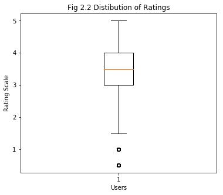
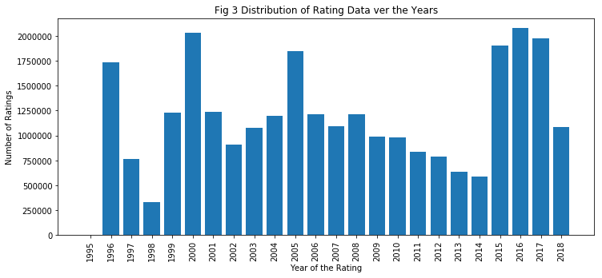
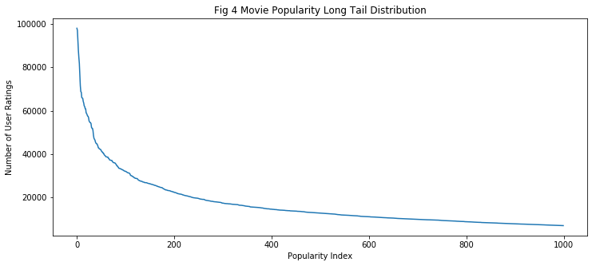

"Final project : Recommending the next best movie" 

Team Members: Ashwin Jayaraman, Somendra Tripathi, Akhil Punia

# About the Movie Lens Data Set

### Key Features
- Sparsity
- Size of the DataSet

### Challenges
- Outliers

- Model Explainability and User Trust

- 

# Approaches
- [Approximate Nearest Neighbors (ANN) using Locality Sensitive Hashing (LSH)](ANN.md)
- Factorization Machines
- [Deep Learning Approaches: Autoencoders and Learning Embeddings through Shallow Networks](DeepLearning.md)

# Discussion on Results
- Metrics
  - Quantitaive ( Accuracy, RMSE )
  - Qualitative ( Top K Recommendations )
- 

- Why do Autoencoders don't work ?
  - Cannot distinguish between a bad rating and a sparse data
  - Needs large GPU resources to train on the movielens data
  - Future: Might Have to look into Sparse Autoencoders, or frameworks like Amzon DSSTNE
- Embeddings
  - Do a good job at obtaining a latent space representation of movies.
  - can be visualised using TSNE.
