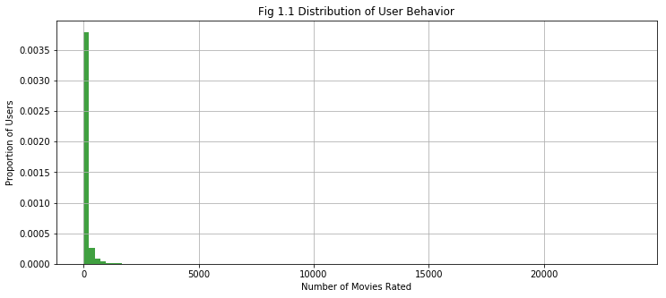
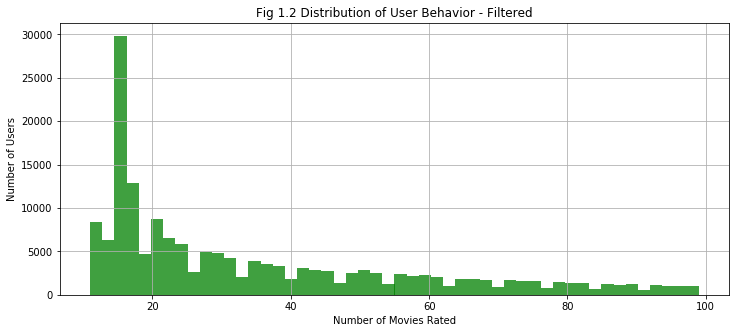
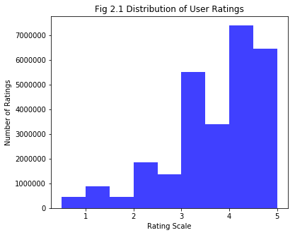
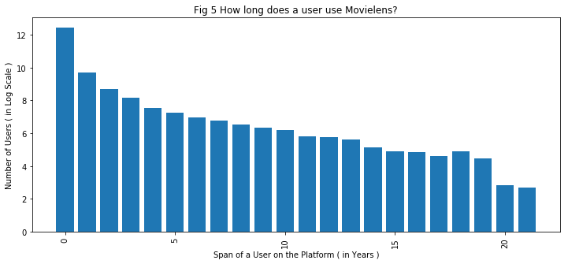

# Final project : Recommending the next best movie

**Course:** E4571 Personalisation Theory, Fall 2018, Columbia University

**Instructor:** Prof. Brett Vintch

**Team Members:** Ashwin Jayaraman, Somendra Tripathi, Akhil Punia

## About the Movie Lens Data Set

Full: 27,000,000 ratings and 1,100,000 tag applications applied to 58,000 movies by 280,000 users. Includes tag genome data with 14 million relevance scores across 1,100 tags. Last updated 9/2018. [Link](http://grouplens.org/datasets/movielens/latest/)

> **Observations:**
- Of the 2,83,228 users using Movies around 69,000 people rated more then 100 movies and 45,912 users have rated less than 10 movies.
- We would want to remove those users who have rated the movies highly from the catalogue as it maybe from a bot account or professional reviewer. Since, we are trying to model the interrests of the larger public it would make sense to take the data of users who haven't rated more than 100 movies.
- Also new users who have rated less than 10 movies, present the classical cold start problem. We should not use them in building our recommender simply because enough data is not available.

> **Observations:**
- We see that the average rating is centred around the 3.5 and the interquartile range is between 3-4. A lot of movies have been highly rated.

> **Observations:**
- In this particular sample of dataset provided from Movielens, we see a sudden resurgence in the number of available ratings beginning from the year 2015.

> **Observations:**
- The Popularity of Movies follow the long tail distibution which exemplifies the pgenomenon of rich gets richer. More Popular movies get more ratings.

> **Observations:**
- Majority of the Users use the platform for rating for only single year. It is expected as it is an academic dataset and not a commercial product which monitors its users over the years.
- This provides an interesting challenge in which the older movies will tend to be the most rated as new movies only have a fraction of overall users to receive ratings from.

Code for EDA is available [here](eda.ipynb).

## Business Problem

For the purposes of this project, we regard ourselves as a movie recommendation and review website which prides itself with quality recommendations that it is able to generate for its registered users.

Our business model is built around selling our customers digital content (like iTunes) and recommending them to subscription services where they can watch their favorite movies. Another part of our job is to engage users on our platform, so that they actively use it to review new movies. It is extremely important to us as it will ensure that we continuously build a growing repository of data that is both rich ( both in quality and quantity ) and relevant with changing time.
Two way we supply these recommendations:
- Display top recommeded movies on our website dashboard.
- Sending out emails to registered users with relevant recommednations to keep them engaged with our platform.
### TLDR
**Maximize:** Online Purchases and Website Engagement

**Avoid:** Becoming a Spammer. Focus on Quality Recommendations.

The objective then is to identify what number of active users on platforms should be targeted and with what frequency.
In easy terms, this task can be be simply understood as making Top 5 recommendations to a carefully selected subset of registered users.

### Challenges
- Sparsity 

- Outliers
 
 
- Model Explainability and User Trust

Using collaborative filtering models

- Serendipity

How to not just recommend popular items? In Top K recommendations we ca try adding new item

- Cold Start Problem
New user s

## Approaches
- [Approximate Nearest Neighbors (ANN) using Locality Sensitive Hashing (LSH)](ANN.md)
- Factorization Machines
- [Deep Learning Approaches: Autoencoders and Learning Embeddings through Shallow Networks](DeepLearning.md)

## Summary
- Metrics
  - Quantitaive ( Accuracy, RMSE )
  - Qualitative ( Top K Recommendations )

- Why do Autoencoders don't work ?
  - Cannot distinguish between a bad rating and a sparse data
  - Needs large GPU resources to train on the movielens data
  - Future: Might Have to look into Sparse Autoencoders, or frameworks like Amzon DSSTNE
- Embeddings
  - Do a good job at obtaining a latent space representation of movies.
  - can be visualised using TSNE.
